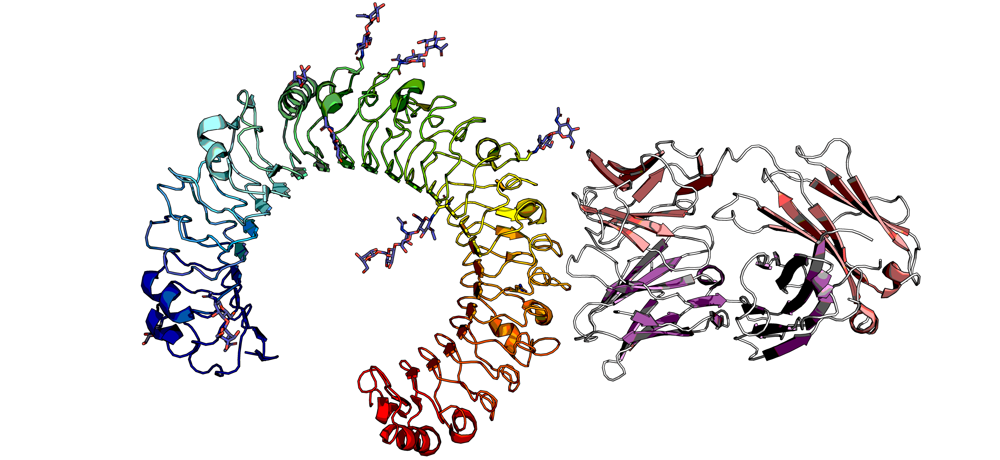

---

# ANABAG Handler


This repository contains Python scripts that help you **select specific protein complexes and features** from the **ANABAG** dataset.

---

## What Is ANABAG?

**ANABAG** the ANnotated AntiBody AntiGen is a dataset containing structural and sequential information about Antibody Antigen complexes. ANABAG contains initial and formated 3D coordinates of complexes, per sequence and per residue pre computed features. The dataset is updated every month. Before using this repository, you need to download the dataset separately (instructions below).

---

## Step 1: Download the ANABAG Dataset

1. Download the ANABAG dataset from this link:
    **[Download ANABAG Here](!-- TODO: insert download link --)**
2. Once downloaded, extract the `.tar` archive (you can double-click it on most systems, or use the command line by opening a terminal):

   ```bash
   tar -xvf ANABAG_dataset.tar
   ```
3. Move the extracted folder into this project directory (where this README is located).

---

## Step 2: Install Requirements

To run the scripts, you need **Python 3** and a few common Python packages.

If you use **Conda** , run the following in your terminal:

```bash
conda create -n anabag_env python=3.10 pandas jupyter numpy matplotlib seaborn
conda activate anabag_env
```

---

## Step 3: Select Complexes or Features

You can select specific protein complexes or per-residue features using a **configuration file** and the provided Python script.

### Example Command:

```bash
python src/select_complexes.py path/to/ANABAG path/to/your_config.config 

python src/select_complexes.py ./ dataset_info/selection_file_complete.config

```

Replace:

* `path/to/your_config.config` with your custom configuration file
* `path/to/ANABAG` with the folder where you extracted the dataset

The selected data will be copied in /my_dataset.
You can find the structures in /my_dataset/structures, and the per residue and per sequence features in /my_dataset/files  

---

## Create a Configuration File

The configuration file tells the script **which features** to use for selecting cases.

* You can find an example here:
  `dataset_info/example_configuration`
* A full list of available complex-level and per-residue features is here:
  `dataset_info/complete_dictionnary_of_features.txt`

<!-- TODO: Add a brief explanation or visual of what the configuration file looks like -->

There are four sections in the configuration file:
Parameters for: Antigen
Parameters for: Antibody
Parameters for: Complex
Parameters for: Selection
---

## Visualize the Data (Optional)

To preview or explore the selected data, open the Jupyter notebook included in this repo. ./src/quick_analysis_example.ipynb

1. Start Jupyter Notebook:

   ```bash
   jupyter notebook
   ```
2. Open the notebook file: `... .ipynb` <!-- TODO: Insert the actual notebook filename -->
3. When prompted, enter the path to the folder where your selected data is stored.

### Example Visualizations

<!-- TODO: Insert or describe example plots (e.g., heatmaps, scatter plots) -->

---

## Structure
```
ANABAG-handler/
├── src/
│   └── select_complexes.py                 # Script for selecting complexes
│   └── quick_analysis_example.ipynb        # notebook for example visualisation
├── dataset_info/
│   ├── selection_file_complete.tsv         # Configuration file with all possible parameters
│   ├── cluster_informations.tsv            # Sequence and interface clustering
│   ├── per_chain_pdbff_informations.tsv    # Features (per chain) for selection
│   ├── method_resolution.tsv               # Experimental and SabDab Dervied informations
│   ├── sequences_initial_chain.tsv         # Chains and sequences pre-formatting
│   └── sequences_formated_chain.txt        # Chains and sequences post-formatting
├── README.md
```
